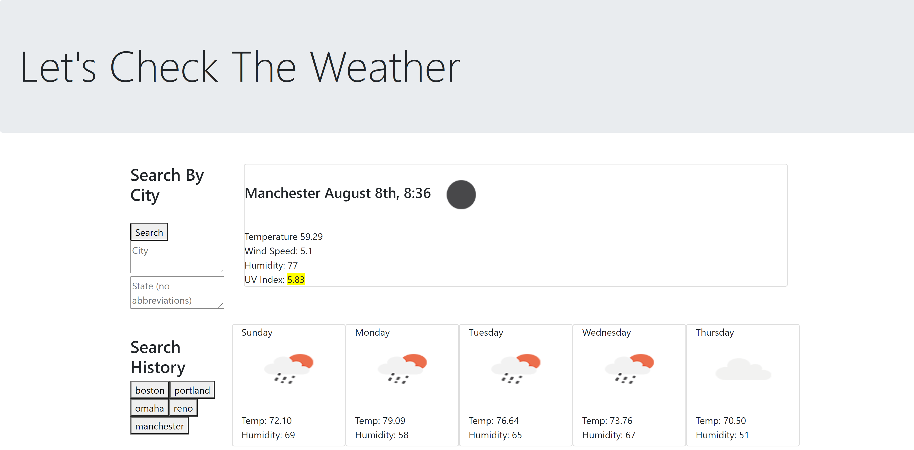

# Weather-Dashboard

Weather application using OpenWeather API

This is an application that allows users to 
search for weather in any city, and in return get the current weather conditions and a 5 day forecast. The cities that you search for can be accessed again by buttons that are created dynamically in the side bar. The last city you searched for will be saved to local storage and will automatically appear when yo u refresh the page. 

<a href="https://mlanglois333.github.io/Weather-Dashboard/">Click here for deployed ap</a>